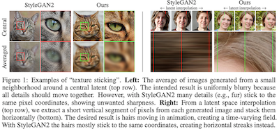
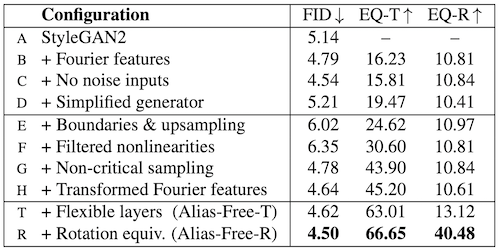
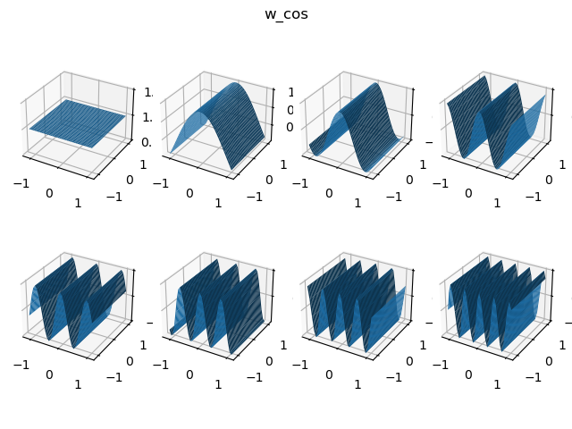
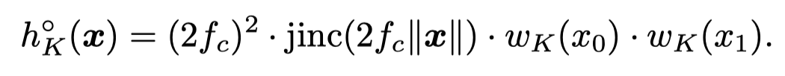
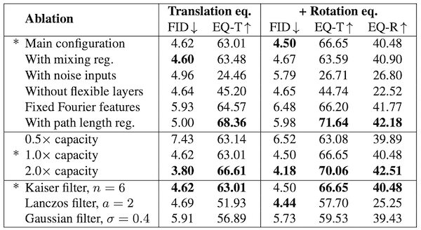
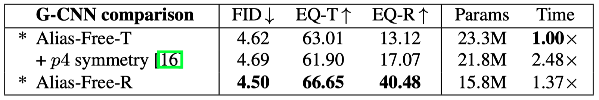

# alias-free-gan-explanation
Trying to understand alias-free-gan in my own way.

[[Chinese Version 中文版本]](README_zh.md)

[CC-BY-4.0 License](LICENSE). [Tzu-Heng Lin](https://lzhbrian.me)

**motivation of this article**: So, the thing is, I've been reading the paper for several days, and the paper is written in a way that I find really hard to understand. Thus, I decide to rephrase the main idea of the paper in my language. Some explanation might be different from the original paper. Of course, I might be making mistakes, so please feel free to correct me.

**disclaimer**: This paragraph is only my personal understanding. One is suggested to read the original paper. Details related to implemtation are not discussed here.

Karras, Tero, et al. Alias-Free Generative Adversarial Networks. arXiv preprint arXiv:2106.12423 (2021).

[[Original Paper]](https://arxiv.org/abs/2106.12423) [[Code]](https://github.com/NVlabs/alias-free-gan)

**Overall Logic:**

* **Modeling**
    * Signals flow through the network are interpreted as **continuous signals**. The actually used feature maps are just **discrete samples** of them.
* **Problem Identifying** 
    * Discovering that current network architectures do not have a clear mechanism to restrict the generator to synthesis images in a **strict hierarchical manner**. Moreover, due to the fact that the frequencies of feature maps do not meet the condition of Nyquisit-Shannon Sampling Theorem, **aliasing** happens.
* **Problem Solving**
    * Redesign a network that is **alias-free** and strictly follows the **hierarchical synthesizing manner**.
* **Analysis**
    * We can show that **alias-free** generators are translation or rotation **equivariant**.
    * We can show that **equivariant** generators do not encounter the **"texture sticking"** phenomenon.

**TOC**

* [1. Motivation](#1-motivation)
    * [1.1 Continuous and Discrete Signals](#11-continuous-and-discrete-signals)
    * [1.2 Problems of Exisiting Architecture](#12-problems-of-exisiting-architecture)
    * [1.3 Main Contribution](#13-main-contribution)
* [2. Method](#2-method)
    * [2.1 Basic Op Redesign](#21-basic-op-redesign)
    * [2.2 Equivariant and Texture Sticking](#22-equivariant-and-texture-sticking)
    * [2.3 Detailed Design of Overall Network Architecture](#23-detailed-design-of-overall-network-architecture)
* [3. Experiments](#3-experiments)
    * [3.1 Dataset](#31-dataset)
    * [3.2 Quantitative and Qualitative Results](#32-quantitative-and-qualitative-results)
    * [3.3 Ablation Study](#33-ablation-study)
    * [3.4 Feature Map Visualization](#34-feature-map-visualization)

## 1. Motivation

#### 1.1 Continuous and Discrete Signals

  

Firstly, we need to interpret the information flow through the network in a more appropriate way. (with signal processing).

* The authors utilize the concepts in signal processing, and interpret the information flow through the network as **spatially infinite continuous signals**. The feature maps we actually used are just **discrete samples** of the continuous signals in a **targeted canvas**. They can be seen as a convenient encoding of the continuous singals. If we set the unit square [0, 1] in the continuous singals as our targeted canvas, the **size of the feature maps** can then represent the **sampling rate** when converting continuous signals to discrete ones.
* The high/low frequencies we are talking about are those frequencies we obtained in the **frequency domain** after we apply **fourier transform** to the continuous singals.
* Since the procedure is sampling, the conditions of **[Nyquist-Shannon Sampling Theorem](https://en.wikipedia.org/wiki/Nyquist%E2%80%93Shannon_sampling_theorem)** need to be satisfied. That is to say, the highest frequencies of the continuous signals must be smaller than **half of the sampling rate** (this is often called the **[Nyquist Frequency](https://en.wikipedia.org/wiki/Nyquist_frequency)**), or else the problem of **[aliasing](https://en.wikipedia.org/wiki/Aliasing)** would happen. (See Figure below.)

  

#### 1.2 Problems of Exisiting Architecture

Ideal way for GANs to synthesize information:

* **Hierarchical Manner:** From shallow to deep layers, synthesizing features from coarse to fine, from low to high frequencies. (For example, synthesizing a face would follow orders like: overall contour of the face -> ... -> skin -> pores, beard, other textures on skin)

Problems for existing GANs:

* We find that existing GAN network architectures do not have a mechanism to restrict the generator to synthesis images in a **strict hierarchical manner**. Although they limit the resolution of feature maps in each layers to let feature maps in shallow layers cannot represent high frequency signals, but the new frequencies generated by operations in each layer, cannot be guarenteed to be smaller than the corresponding Nyquisit Frequency. If the above condition does not meet, the problem of **aliasing** would happen, which would make the high frequencies to be represented as low frequencies in the frequency domain, contaminating the whole signal.

#### 1.3 Main Contribution

We want to design a network architecture, that strictly follows the ideal **hierarchical manner of synthesizing information**. Every layer is restricted to only synthesizing frequencies in the range that we designated to them, and thus, removing the problem of **aliasing**. (That's why the paper is called Alias Free GAN, IMO). 

## 2. Method

#### 2.1 Basic Op Redesign

Existing GANs contain basic Operations like: Conv, Upsamling, Downsampling, Nonlinearity. In the following, we will analyze them respectively, to see if they have the problem of aliasing. And if so, how do we fix them.

* Conv

    * Convolution, it is used to locally reorganize signals, producing signals that meet our expectations more.
    * Convolution itself does not introduce new frequencies. (Convolution in time domain is equivalent to multiplication in the frequency domain. So where originally 0 is still 0 in the frequency domain).

* Downsampling (See Figure Below)

    * Resample a signal to a lower sampling rate (s -> s', where s>s'). It is used to let the viable area smaller in the spectrum.

    * Notice that the sampling rate afterwards could be smaller than twice of the highest frequencies of the original signal. Thus, we need to use a Low Pass Filter beforehand to restrict the frequencies of the original signal to be less than half of the lowered sampling rate, then can we do the downsampling procedure (dropping points).

        

          
        

* Upsampling (See FIgure Below)

    * Resample a signal to a higher sampling rate (s -> s', where s<s'). It is use to add headroom in the spectrum, to let the viable area larger (So that subsequent layers can introduce new frequencies). Note that itself does not introduce new frequencies.

    * The procedure is achieved by first interleaving the original signals with 0, then use a Low Pass Filter to remove imaging in the frequency domain. Note that, the LPF used here is using cutoff=s/2, sampling rate=s'.

    * The upsampling and downsampling procedures introduced above might seem a little confusing for one who haven't learnt signal processing lessons before. However, they are actually the widely used procedures in the field of signal processing to resample signals. And they are very intuitive when explaining them with the Figure above.

        

            
        

* Nonlinearity (See [Video](videos/video_7_figure_2_right_filtered_nonlinearity.mp4))

    * Elementwisely nonlinearity (e.g. ReLU). It is used to introduce new frequencies.
    * The new frequencies introduced by nonlinearity contains two parts: the 1st part that meets the condition of the sampling theorem, and the 2nd part that doesn't. We want to preserve the former and eliminate the latter. However, if we directly apply nonlinearity to the discrete feature map, the newly introduced 2nd part frequencies will directly create aliasing.
    * Thus, the authors propose a very interesting method: Firstly, you upsample the signal by m (usually set to 2), then you apply the nonlinearity, and finally you downsample the signal back. The first upsampling is to increase the Nyquisit Frequency, adding headroom for the 2nd part frequencies newly introduced to avoid aliasing. Then, the downsampling procedure (including a LPF to eliminate the 2nd part frequencies) convert the signal back to its original sampling rate.

* [Low Pass Filter](https://tomroelandts.com/articles/how-to-create-a-simple-low-pass-filter)

    * Notice that downsampling, upsamling, nonlineaity operation introduced above use LPF. 
    * The authors use a [Kaiser-Windowed Sinc Filter](https://tomroelandts.com/articles/how-to-create-a-configurable-filter-using-a-kaiser-window) (a FIR LPF) because it can directly manipulate transition band and attenuation. 
    * Two very good links on LPF and Kaier window: [link1](https://tomroelandts.com/articles/how-to-create-a-simple-low-pass-filter), [link2](https://tomroelandts.com/articles/how-to-create-a-configurable-filter-using-a-kaiser-window).

#### 2.2 Equivariant and Texture Sticking

Equivariant means that when the input translate, the output translate equivalently. We can define to kinds of equivariant: Translation Equivariant, and Roation Equivariant.

**Translation Equivariant**

* We can show that the alias-free network is translation equivariant naturally.
    * According to the above theoretical analysis, if we treat the signal as infinite continuous signal in the time domain throughout the network, the shift of the signal in the time domain does not actually change the amplitude of the signal in the frequency domain. Therefore, no matter how you move the input signal up, down, left, and right in the time domain, the output of each layer of the network will move along with it, and the final output signal will definitely move along with it.

* The authors define a metric to evaluate the translation equivariance: EQ-T. Basically, it calculates the difference between two sets of images: translating the input or output of the syntheis network by the same random amount.

    

**Rotation Equivariant**

* For rotation equivariance, we need some modification to Conv and LPF
    * Conv: We need keernel to be radially symmetry in the time domain. This is easy to understand. If you rotate the input signal, the most intuitive and simple way is to perform the same rotation for Conv kernels. In this way, there is no relative movement between the two, which is equivalent to the original operation.
    * Low Pass Filter: We also need keernel to be radially symmetry in the time domain. The explanation is similar to Conv.

* The authors define a metric to evaluate the rotation equivariance: EQ-R.

    

**Texture Sticking** ([video](videos/slice-vid.mp4))

  

* We can show that equivariant networks do not have such phenomenon. The manifestation of this phenomenon is that high and low frequency features will not be transformed at the same speed together. But if the network has equivariance, then all features must be transformed together at the same speed, and this phenomenon will naturally not occur.

#### 2.3 Detailed Design of Overall Network Architecture

  

Apart from the changes of the basic operations, there are other changes in the network architectures.

* (config B,H) Fourier Features
    * (B) Change original 'learned constant input' to 'Fourier Features'. 

        * According to the previous analysis, the input that we essentially deal with is an infinite continuous signal, so the authors use Fourier Features here, which naturally have spatially infinite characteristics. The discrete input signal can be sampled from the continuous expression. At the same time, because there is an actual continuous expression, we can also easily translate and rotate the signal, then sample it and input it into the network, so that we can calculate EQ-T and EQ-R conveniently.

        * What exactly does the Fourier Feature look like? The authors' official implementation in unknown yet. According to [rosinality/alias-free-gan-pytorch](https://github.com/rosinality/alias-free-gan-pytorch/blob/d1a4c52ea0be9a6a853fe10e486402b276aef94b/model.py#L193), it uses each piece of feature map to represent some frequency of sin or cos signal on x or y direction (which makes it 4 feature maps for each frequency). Code is implemented here: [plot_fourier_features.py](plot_fourier_features/plot_fourier_features.py).

            

                
                
                
                
            

    * (H) Transformed Fourier Features (Appendix F)
        
        * The above Fourier features are randomly rotated or translated in the time domain (that is, the style of w also controls the input signal), and then being fed into the network. w -> t = (rc, rs, tx, ty)， t = t/sqrt(rc^2+rs^2). code is implemented here: [plot_fourier_features.py](plot_fourier_features/plot_fourier_features.py)

* (config E) 10px margin expanded to the original feature maps
    
    
    * In the above theoretical assumptions, the signals are spatially infinite, and the Conv, Upsampling, and Downsampling calculations at the edge will also use the values outside the boundary of the targeted canvas, so here we can use the following approach to approximate the infinite feature map :
    

        * Expand the feature map by a 10px margin.
    
        * If the feature map is upsampled, the margin is also upsampled, so we need to crop the margin after upsampling to make it remain to 10px.
    
        * If there is no upsampling, then no extra care is needed.
    
            

              
            

    
* (config E,G,T) Sampling rate and LPF design
    * (E) According to the above analysis, a very intuitive approach (critical sampling) is to set the cutoff fc of the low-pass filter to half of the sampling rate s/2, and set half of transition band fh to (\sqrt{2}-1) (s/2) .

    * (G) However, doing so is actually dangerous, because our low-pass filter is just an approximation, it is not an ideal rectangular window in the frequency domain, so there will be some missing frequencies that can still pass through around the critical point. So here, the authors set cutoff fc to s/2-fh. The intuitive understanding is to keep less and filter out more. It is safer to avoid aliasing. Except for the last few layers, cutoff is still set to s/2, because the last layers really needs more high-frequency features.

    * (T) The authors found that the attenuation of the aforementioned low-pass filter is still insufficient for the low-resolution layers. The original design philosophy have fixed rules for each layer. The authors propose to design each layer separately here. They hope to have as large attenuation as possible in the low resolution layers, and keep more high frequency features in the high resolution layers.

        * The right most figure below shows a N=14 Generator design. The last two layer is critical sampled.
        * The cutoff fc (blue line) grows geometrically from fc= 2 in the first layer to fc= sN/2 in the first critically sampled layer.
        * The minimum acceptable stopband freq ft (yellow line) starts at f_{t,0} = 2^2.1 , and grows geometrically but slower than the cutoff fc. For the last two layers, ft = fc * 2^0.3.
            * f_{t,0} provides an effective way to trade training speed for equivariance quality.
        * The sampling rate s is set to double of the smallest multiple of two which is larger than ft. (but not exceeding the final output resolution).
        * Half of the transition band fh = max(s/2, ft) -fc
        * Now the number of layers N is not completely dependent on the output resolution. The authors then set the number of layers for all resolutions to 14.

        

            
            
            
        

* (config R) Rotation Equivariance. As stated above, we need to change Conv and LPF to radially symmetry kernels.
    
    * Conv: replace all 3x3 conv with 1x1.
    * LPF: use jinc filter with the same Kaiser Window:
        
    
* (config C, D) Others
    * (C) removing per-pixel noise. Since the spectrum of gaussian noise has the same intensity on all frequency, obviously it does not meet the sampling theorem.
    * (D) simplify generator. including:
        * mapping network 8->2
        * eliminate mixing regularization
        * eliminate path length regularization
        * eliminate skip connection, change to normalization using EMA of sigma

## 3. Experiments

#### 3.1 Dataset

* FFHQ-U and MetFaces-U: unaligned version of FFHQ and MetFaces. Difference with the original version: Axis-aligned crop, preserving orginal image angel, random crop face region, no mirrored.
* AFHQv2: The original AFHQ use inappropriate downsampling, which results in aliasing. The new version use PIL's Lanczos.
* Beaches: 20,155 photos, 512x512

#### 3.2 Quantitative and Qualitative Results

  

* FFHQ (1024×1024) 
    * \# of params of the three Generator are: 30.0M, 22.3M, 15.8M
    * Training time (GPU hour): 1106, 1576 (+42%), 2248 (+103%) 
* Equivariance ([video](videos/video_5_figure_3_left_equivariance_quality.mp4), [video](videos/video_6_figure_5_right_g-cnn_comparison.mp4))
* Texture Sticking phenomenon disappear ([video](videos/video_0_ffhq_cinemagraphs.mp4), [video](videos/video_1_ffhq_cinemagraphs.mp4))

#### 3.3 Ablation Study

  
  

* mixing reg. does no harm, but is somewhat useless(Appendix A)
* per-pixel noise compromises equivariances significantly.
* Fixed Fourier Features harms FID.
* path length reg. harms FID, but improves equivariance (strange behavior). (Path length regularization is in principle at odds with translation equivariance, as it penalizes image changes upon latent space walk and thus encourages texture sticking. We suspect that the counterintuitive improvement in equivariance may come from slightly blurrier generated images, at a cost of poor FID.)
* Capacity: halving the number of feature maps harms FID but the network remains equivariant. Doubling the number improves FID, yet with 4x training time.
* DIfferent window function for sinc/jinc filter: Kaier, Lanczos, Gaussian. Lanczos is best on FID yet compromises equivariance. Gaussian leads to clear worse FID.
* p4 symmetry G-CNN is not even close compared to Alias-Free-R on rotation equivariance.

#### 3.4 Feature Map Visualization

[video](videos/fig6-video.mp4)

  

