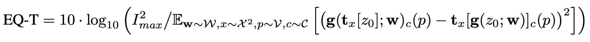
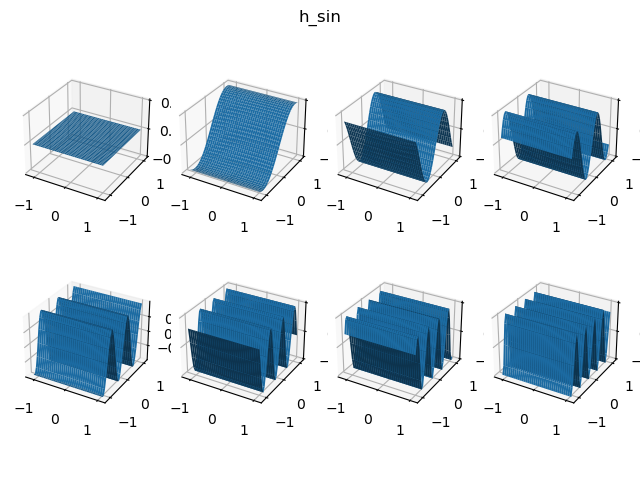

# alias-free-gan-explanation
尝试用我自己的方式来理解 alias-free-gan

[[English Version]](README.md)

[CC-BY-4.0 License](LICENSE). [Tzu-Heng Lin](https://lzhbrian.me)

**写这篇文章的动机**： 最近花了几天的时间看了下这篇 paper， 感觉这篇论文实在是让我太难读懂了。 所以我希望重新用我自己的语言组织一下这篇论文的主要思想， 可能有一些表述会与原文不同。 当然， 我的理解可能会出现偏差， 如果有的话请随意纠正我。

**免责声明**： 仅是我自己对这篇文章的理解， 还是建议去看原文。 Repo 里放的视频都来自 [原文的官网](https://nvlabs.github.io/alias-free-gan/)。

Karras, Tero, et al. Alias-Free Generative Adversarial Networks. arXiv preprint arXiv:2106.12423 (2021).
[[原论文]](https://arxiv.org/abs/2106.12423) [[代码]](https://github.com/NVlabs/alias-free-gan)

**整体逻辑（个人理解）**：

* 建模： 将网络流过的信息视为连续信号， 离散特征图视为对连续信号的采样
* 发现问题： 发现目前的网络结构并没有 明确的机制 将其 限制成 按照理想的 层级式生成信息， 同时由于不满足采样定律 会产生混叠（aliasing）的现象。
* 解决问题： 重新设计网络，将 aliasing 去除， 得到较理想的结构
* 网络性质分析：
    * 理论分析、实验证实： 去除 aliasing 后的网络具有等变性（equivariant）
    * 理论分析、实验证实： 具有 equivariant 这个属性的网络结构里， 不会出现 texture sticking 的现象

**目录**

* [1. 动机](#1-动机)
    * [1.1 连续与离散信号](#11-连续与离散信号)
    * [1.2 现有 GAN 网络的问题](#12-现有-gan-网络的问题)
    * [1.3 本文核心](#13-本文核心)
* [2. 方法](#2-方法)
    * [2.1 基本操作设计](#21-基本操作设计)
    * [2.2 等变性 (Equivariant)、 Texture Sticking](#22-等变性-equivariant-texture-sticking)
    * [2.3 网络结构具体设计](#23-网络结构具体设计)
* [3. 实验](#3-实验)
    * [3.1 数据集](#31-数据集)
    * [3.2 定量定性结果](#32-定量定性结果)
    * [3.3 消融实验](#33-消融实验)
    * [3.4 特征图可视化](#34-特征图可视化)

## 1. 动机

#### 1.1 连续与离散信号

  

首先， 我们需要先对 从网络流过的信息 进行一个比较严谨的建模（需要一些信号处理相关知识）
* 作者使用了信号处理相关的知识， 将网络里流过的信息 看成了 **连续信号**， 实际处理的 **离散特征图** 是 对连续信号 的 **一块中间区域** 的 **采样**， 一种方便的表达方式。 离散特征图的 **分辨率** ， 就对应到了采样时的 **采样率**。
* 我们说的 **高频、低频** 就是指信号通过 **傅里叶变换** 后在 **频域** 里的频率大小
* 既然是采样， 就需要满足 **奈奎斯特-香农采样定律**（以下简称采样定律）， 就是说信号 **本身的频率** 必须小于 **采样率的一半**（也称 **奈奎斯特频率=采样率/2**）， 这样才不会出现 **aliasing（混叠）** 的现象。

#### 1.2 现有 GAN 网络的问题

理想 GAN 的生成信息方式： 
* **层级式生成信息**， 从网络的浅层到深层，逐层生成 由粗到细的特征， 由低频到高频 的信息 （e.g. 想生成一张脸， 会按照下面的顺序： 脸的整体轮廓 -> ... -> 皮肤 -> 皮肤表面上的纹理、胡子等） 

现有 GAN 网络的问题： 
* 按照上面的建模方式， 我们发现， 其实现有的 GAN 的网络结构并没有一个很好的机制去限制 GAN 严格地按照层级式来生成信息。 虽然现有的 GAN 通过限制分辨率（采样率）的方式来让 浅层网络的特征图 无法表示 高频信息， 但是网络的每层操作， 对应在连续域生成的新频率， 并不一定小于那一层采样率对应的 奈奎斯特频率。 如果不满足的话， 就会出现 **混叠（aliasing）** 的现象， 原来的高频信号也会被重构成低频信号， 污染了整个信号。

#### 1.3 本文核心

希望设计一个 GAN 的网络结构， 可以遵循严格的理想的 **层级式生成信息**， 让每一层都只生成我们想让它生成的频率范围， 去除掉 现有网络里的 **混叠（aliasing）** 问题 （所以本文取名为 Alias Free GAN， 个人认为是这样）。

## 2. 方法

#### 2.1 基本操作设计

现有 GAN 网络包括的一些基本操作有： Conv， Upsampling， Downsampling， Nonlinearity 四种。 接下来我们就来分别分析， 它们是否有 aliasing 的问题， 并且如果有的话应该如何改进。

    
  

* Conv
    * 即卷积。 它的作用是将原信号在局部进行重组， 产生更符合我们预期的新信号。
    * conv 本身不引入新的频率（时域卷积等价于频域相乘， 所以频域里原信号是0的地方还是0）， 所以不会出现 aliasing 的问题。 
* Downsampling
    * 顾名思义， 降低采样率。 它的作用是让原先被采样的连续信号所能包含的频率范围变小
    * 需要注意的是， 降低后的采样率很有可能超过信号本身的频率的2倍， 因此在降低采样率前， 需要先过一个低通滤波器， 使得信号本身的频率不超过降低采样率后的奈奎斯特频率。 （见上图）
* Upsampling
    * 顾名思义， 提高采样率。它的作用是扩大被采样的连续信号所能包含的频率范围（根据采样定律）， 使其能包含更高频的信息， 但注意其本身并不引入新的频率。
    * 需要注意的是， 虽然其本身并不会发生 aliasing 的问题， 但是在信号处理里分析过， 上采样时的一般操作是先补0， 然后再低通滤波去除频域镜像， 所以这里也需要一个低通滤波器。 注意， 这里使用的低通滤波器 与 前面 downsampling 的参数是不一样的， 虽然 cutoff 都会设置成较低频信号采样率的一半， 但是这里低通滤波器的采样率是输出信号的采样率（这会让低通滤波器的频域响应在不同周期处进行重复） （见上图）
* Nonlinearity
    * 逐点进行非线性操作。 它的作用就是引入新的高频信息。
    * nonlinearity 引入的新频率包括两部分： 满足采样定理的部分 <s/2、 不满足采样定理 >s/2）。 我们想要的是前者。 如果直接对离散特征图做 nonlinearity， nonlinearity 产生的大于奈奎斯特频率的部分， 就会让离散的特征图直接出现 aliasing 的现象。 对此， 作者提出了一个很有意思的做法， 先 upsampling m 倍 ， 然后做 nonlinearity， 再 downsampling 回来。 这个做法直观来理解就是先 upsampling 提高奈奎斯特频率， 使得 nonlinearity 出现的新频率尽量不超过新的奈奎斯特频率， 然后再 downsampling （包括 low pass filter 滤除大于原来奈奎斯特频率的部分） 回来到原采样率下。 这里作者发现 m 一般取 2 就足够了（见 [视频](videos/video_7_figure_2_right_filtered_nonlinearity.mp4)）
* Low Pass Filter
    * 注意到， 上面的 Downsampling， Upsampling， Nonlinearity 都需要用到 低通滤波器， 作者在文中选用了 Kaiser-windowed sinc filter（一种 FIR 低通滤波器）， 因为它可以直接调整 transition band 和 attenuation 的大小。

#### 2.2 等变性 (Equivariant)、 Texture Sticking

等变性， 顾名思义就是当输入移动的时候， 输出信号也会跟着一起移动。 我们可以定义两种等变性： 平移等变性、 旋转等变性。

**平移等变性（Translation Equivariant）**

* 我们发现， 如果网络完全消除掉了 aliasing 的影响， 那么整个网络其实已经具有了平移等变性。
    * 为什么呢？  按照上面的理论分析， 如果从连续信号的角度考虑看， 网络的输入是一个时域无限的连续信号， 中间经历了一些操作对信号进行局部重组（Conv）、 新频率的生成 （Nonlinearity），从头到尾在时域都是无限的连续信号的话， 信号时域的平移其实不改变信号的频域的幅度。 因此不管你在时域对输入信号如何进行上下左右平移， 网络的每一层输出都会跟着一起平移， 最终的输出信号肯定也会跟着对应着一起平移。 
* 文中定义了一个指标来衡量平移等变性： EQ-T， 大致意义就是比较 <u>直接对图像做变换</u> 与 <u>对输入做变换后输出图像</u> 两者之间的区别

    

**旋转等变性（Rotation Equivariant）**

* 对于旋转等变性， 还需要对 Conv 和 Low Pass Filter 进行一些改动。

    * Conv： 需要 kernel 在时域径向对称。 这也比较好理解， 如果对输入信号进行旋转， 最直观简单的做法就是对上述的操作也进行同样的旋转， 如此一来的话两者就没有相对运动， 与原操作就是等价的。 
    * Low Pass Filter： 需要 kernel 在时域径向对称。  同 Conv 的解释。

* 文中定义了一个指标来衡量旋转等变性： EQ-R， 大致意义同 EQ-T

    

**Texture Sticking**

  

* 原文中开头就提到了 Texture Sticking（[视频](videos/slice-vid.mp4)） 这个现象， 我们可以发现具有 等变性的网络其实就不会出现这个现象。 这个现象的具体表现为高频特征与低频特征不会一起等速进行变换， 但如果网络具有等变性， 那么所有的特征一定都是等速一起变换的， 这个现象自然不会出现。

#### 2.3 网络结构具体设计

  

除了上述的一些基础操作的改变之外， 整体上网络还有一些其他的变化。

* （config B,H） 将网络输入更改为 Fourier Features
    * （B）将原来 StyleGAN2 里的 learned constant input 更改为 Fourier Features。 
        * 根据前面的分析， 我们本质处理的输入是一个无限的连续信号， 因此在这里作者使用了 Fourier Features， 具有无限的特性， 只要对其进行采样就得到实际的离散输入信号。 
        * 同时， 由于有一个实际连续的表达式， 我们也可以很方便的对信号进行平移、旋转， 然后进行采样， 输入到网络里， 方便我们来计算 EQ-T 和 EQ-R。
        * Fourier Feature 具体是什么样子的？ 暂时还不知道作者具体的实现方法， 按照 [rosinality/alias-free-gan-pytorch](https://github.com/rosinality/alias-free-gan-pytorch/blob/d1a4c52ea0be9a6a853fe10e486402b276aef94b/model.py#L193) 的实现，是使用每张 feature map 代表某个频率在 x 或 y 方向上的 sin 或 cos 信号， 所以一个频率对应有 4 张特征图， 代码见 [plot_fourier_features.py](plot_fourier_features/plot_fourier_features.py)。 画出来的图大致如下， 每张图表示八个频率：

            

                
                
                
                
            

    * （H）Transformed Fourier Features（Appendix  F）
        * 将上述的傅里叶特征， 在时域进行随机的旋转或平移（即 w 的 style 也控制输入信号）， 然后再输入到网络中。  w -> t = (rc, rs, tx, ty)， t = t/sqrt(rc^2+rs^2)。 代码见 [plot_fourier_features.py](plot_fourier_features/plot_fourier_features.py)

* （config E） 将特征图往外扩大 10 个px
    * 在上面的理论假设里， 信号都是无限的， 并且边缘处的 Conv， Upsampling， Downsampling 计算也会使用到特征图边界外的值， 因此在这里我们可以采用如下的做法来模拟特征图无限的情况：
        * 将输入特征图往外扩 10个px 的 margin 
        * 如果没有 upsample， 那么 feature map 还是有 10px 的 margin， 不用特别处理。
        * 如果有 upsample， 由于 margin 也会 upsample m 倍， 所以要 在 upsample 做完操作后， 再把>10px margin 的部分 crop 掉。

* （config E,G,T） 采样率及低通滤波设计
    * （E）按照上面的分析， 一个很直观的做法 （critical sampling） 就是将 低通滤波器 的 cutoff fc 设置为采样率的一半 s/2， fh 设置成 (\sqrt{2} - 1) (s/2)。 
    * （G）但是上面这么做的话其实比较危险， 因为我们的低通滤波器是近似的， 在频域不是理想的矩形窗， 因此在临界处会有一些漏掉的频率依然能够通过。 所以在这里， 作者将 cutoff fc 设置成了 s/2 - fh， 直观上理解就是保留少一些， 多滤掉一些， 比较保险不会产生 aliasing。 除了最后几层， cutoff 还是设置成了 s/2， 因为最后一层确实特别需要比较高频的特征。
    * （T） 作者发现， 上述低通滤波器的 attenuation 对于低分辨率层来说仍然不够。 原本的每层设计思路都有固定的规则， 作者在这里提出其实完全可以给每层单独设计， 希望在低分辨率层里具有尽量大的 attenuation， 在尽量高分辨率层里尽量保留大部分的高频特征。
        * 下图展示了一个 N=14 层的 Generator 设计， 最后两层是 critical sampled（fc = s/2）。
        * fc （蓝线）从第一层开始， 一直到倒数第二层几何成长为 sN/2。
        * 最小可接受 stopband freq ft（黄线） 从开始设置为 f_{t,0} = 2^2.1， 同样也几何增长， 但比 fc 慢一些， 倒数两层的 ft = fc * 2^0.3。
        * 每层的采样率 s （红线）设置为 大于等于黄线的最小2的倍数的两倍，（但不超过最终的输出分辨率）
        * fh = max(s/2, ft) -fc
        * f_{t,0} 可以调节来平衡训练速度与等变性
        * 现在层数 N 也不完全取决于输出分辨率了， 作者将所有分辨率的层数都设置成了 14。 （其实应该就是在最后多几层固定最高分辨率）

        

            
            
            
        

* （config R） 旋转等变性。 如前所述， 需要将 Conv 和 LPF 替换成 径向对称 kernel。 
    * Conv： 将 所有 3x3 的 conv 都变成了 1x1 的
    * LPF： 使用了 jinc 函数， 也用了与 sinc 同样的 window 方法：
        

* （config C, D） 其他设计
    * （C）去除 per-pixel noise。 高斯噪声的频域是一个均匀分布， 显然会有不满足采样定律的部分， 因此去除掉。
    * （D）简化 generator。 包括：
        * mapping network 8->2
        * 去除 mixing regularization
        * 去除 path length regularization
        * 去除 skip connection， 改为使用 normalization using EMA of sigma

## 3. 实验

#### 3.1 数据集

* FFHQ-U and MetFaces-U： unaligned 版本的 FFHQ 与 MetFaces， 与原数据集区别：Axis-aliged crop rectangles、 保留原图的图片角度、 随机 crop 一个脸的区域、 不用 mirror pad。
* AFHQv2： 原来的 AFHQ 由于使用了不合适的下采样， 导致出现了混叠的现象， 影响了模型的训练。 改为使用 PIL 里的 Lanczos 重采样方法。
* Beaches： 20,155 photos， 512x512

#### 3.2 定量定性结果

  

* FFHQ (1024×1024) 
    * 三个 G 的参数量分别是：30.0M, 22.3M, 15.8M
    * 训练时间分别是： 1106, 1576 (+42%), 2248 (+103%) GPU 小时
* Texture Sticking 的现象消失了 （见 [视频](videos/video_0_ffhq_cinemagraphs.mp4)， [视频](videos/video_1_ffhq_cinemagraphs.mp4)）
* Equivariant 等变性（见 [视频](videos/video_5_figure_3_left_equivariance_quality.mp4)， [视频](videos/video_6_figure_5_right_g-cnn_comparison.mp4)）

#### 3.3 消融实验

  
  

* mixing reg. 无害， 但也可以不加（Appendix A）
* per-pixel noise 会极大损失等变性
* 固定的 Fourier Features 会损害 FID
* path length reg. 会损害 FID。 原理上说， path length reg 应该会损害等变性， 因为他惩罚了 latent interpolation 时图片的变化， 但实验却让等变性更好了， 作者怀疑是因为生成的图像变糊了才导致等变性指标提高， 也因此让 FID 变差了。
* Capacity： 让特征图的通道数量降低一半会让 FID 变差， 但等变性不怎么改变。 让特征图的通道数量增加一倍会让 FID 变好， 但所需要的训练时间接近原来的 4 倍
* 对于 sinc filter 尝试了不同的窗函数： Kaiser、 Lanczos、 Gaussian。 Lanczos 在 FID 上达到了最好的效果， 但损失了旋转等变性。 Gaussian 则让 FID 变差了很多。
* 使用 p4 symmetry G-CNN 来测试旋转等变性， 发现其与 Alias-Free-R 在旋转等变性上还是差挺多的

#### 3.4 特征图可视化

[视频](videos/fig6-video.mp4)

  

